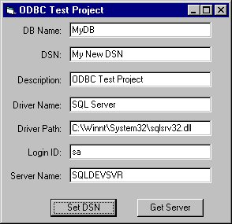



## SetDSN

### Description

This project demonstrates some code concepts such as use of classes, functions, passing variables, and registry control for setting SYSTEM DSN's under ODBC.
 
### More Info
 

             |
---                |---
**Submitted On**   |2001-05-22 15:07:18
**By**             |[Chuck\_Bradley](https://github.com/Planet-Source-Code/PSCIndex/blob/master/ByAuthor/chuck-bradley.md)
**Level**          |Advanced
**User Rating**    |4.5 (18 globes from 4 users)
**Compatibility**  |VB 6\.0
**Category**       |[Databases/ Data Access/ DAO/ ADO](https://github.com/Planet-Source-Code/PSCIndex/blob/master/ByCategory/databases-data-access-dao-ado__1-6.md)
**World**          |[Visual Basic](https://github.com/Planet-Source-Code/PSCIndex/blob/master/ByWorld/visual-basic.md)
**Archive File**   |[SetDSN199205222001\.zip](https://github.com/Planet-Source-Code/chuck-bradley-setdsn__1-23357/archive/master.zip)

